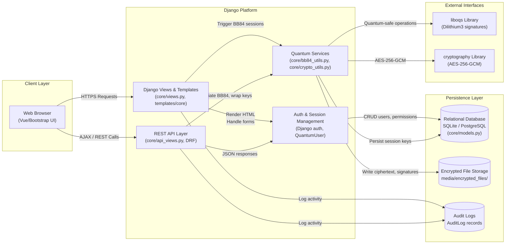
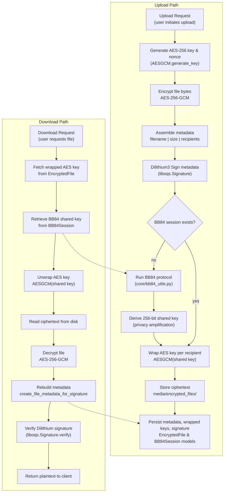

# QuantumVault System Architecture

## Component Notes

- **Client Layer**: Browser-based UI built with Django templates and Bootstrap. Initiates key exchanges, uploads, and downloads via standard views or AJAX calls.
- **Django Platform**: Core application logic. Views handle HTML workflows; DRF-based API endpoints support asynchronous operations and integrations; BB84 utilities manage quantum key exchange simulation and cryptographic operations; authentication layer extends Django's `AbstractUser` with post-quantum keys.
- **Persistence Layer**: Relational database stores users, sessions, audit logs, and metadata. Encrypted file payloads live under `media/encrypted_files/`. Audit logs capture security-relevant events.
- **External Interfaces**: `liboqs` provides Dilithium3 signatures; `cryptography` library handles AES-256-GCM encryption. These libraries underpin the quantum-safe guarantees.

## Cryptographic Workflow (Algorithm Detail)

**Workflow Highlights**
- BB84 sessions are lazily established: uploads trigger `run_bb84_protocol_with_timeline` only if a completed session is missing.
- AES-256 keys are unique per upload; wrapped copies exist per recipient using their BB84-derived shared secret.
- Dilithium3 signatures cover deterministic metadata, ensuring download-time integrity verification.
- Download vetoes release if Dilithium verification fails or if the wrapped AES key cannot be unwrapped with the stored shared secret.
