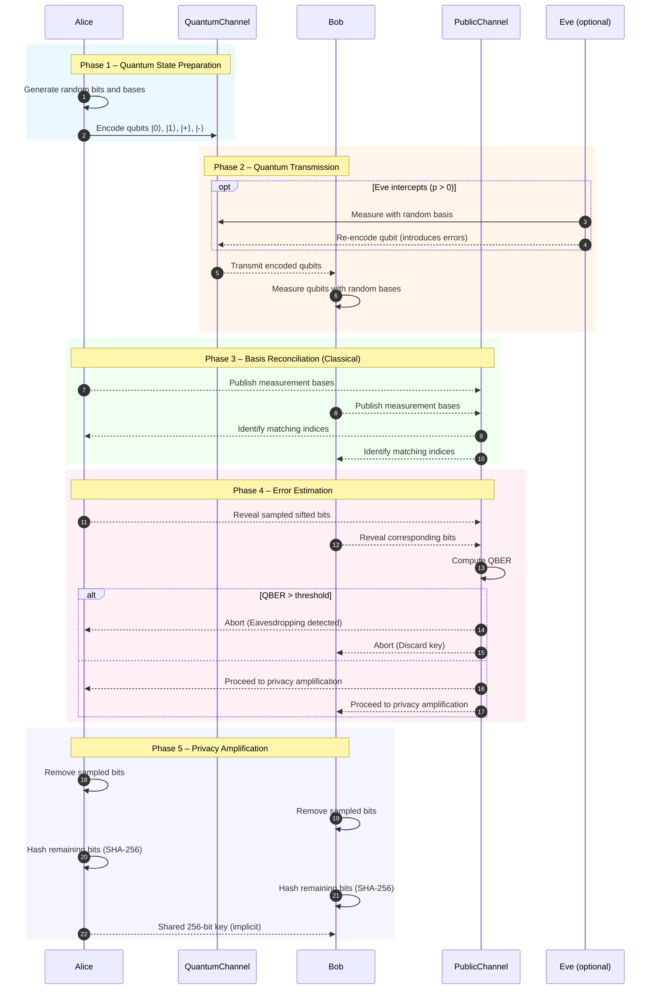

# BB84 Quantum Key Distribution Flow

```mermaid
sequenceDiagram
    autonumber
    participant Alice
    participant QuantumChannel
    participant Bob
    participant PublicChannel
    participant Eve as Eve (optional)

    rect rgb(235, 248, 255)
        Note over Alice,QuantumChannel: Phase 1 – Quantum State Preparation
        Alice->>Alice: Generate random bits and bases
        Alice->>QuantumChannel: Encode qubits |0⟩, |1⟩, |+⟩, |-⟩
    end

    rect rgb(255, 245, 234)
        Note over QuantumChannel,Bob: Phase 2 – Quantum Transmission
        opt Eve intercepts (p > 0)
            Eve->>QuantumChannel: Measure with random basis
            Eve-->>QuantumChannel: Re-encode qubit (introduces errors)
        end
        QuantumChannel-->>Bob: Transmit encoded qubits
        Bob->>Bob: Measure qubits with random bases
    end

    rect rgb(240, 255, 240)
        Note over Alice,PublicChannel: Phase 3 – Basis Reconciliation (Classical)
        Alice-->>PublicChannel: Publish measurement bases
        Bob-->>PublicChannel: Publish measurement bases
        PublicChannel-->>Alice: Identify matching indices
        PublicChannel-->>Bob: Identify matching indices
    end

    rect rgb(255, 240, 245)
        Note over Alice,PublicChannel: Phase 4 – Error Estimation
        Alice-->>PublicChannel: Reveal sampled sifted bits
        Bob-->>PublicChannel: Reveal corresponding bits
        PublicChannel->>PublicChannel: Compute QBER
        alt QBER > threshold
            PublicChannel-->>Alice: Abort (Eavesdropping detected)
            PublicChannel-->>Bob: Abort (Discard key)
        else
            PublicChannel-->>Alice: Proceed to privacy amplification
            PublicChannel-->>Bob: Proceed to privacy amplification
        end
    end

    rect rgb(245, 245, 255)
        Note over Alice,Bob: Phase 5 – Privacy Amplification
        Alice->>Alice: Remove sampled bits
        Bob->>Bob: Remove sampled bits
        Alice->>Alice: Hash remaining bits (SHA-256)
        Bob->>Bob: Hash remaining bits (SHA-256)
        Alice-->>Bob: Shared 256-bit key (implicit)
    end
```
